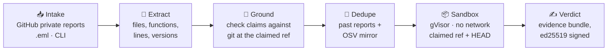

<div align="center">

# Kritolith

**Verify, dedupe, reproduce.**

Kritolith checks incoming security reports before a maintainer reads them.<br>
It tests every claim against the real code, reproduces the PoC in a locked-down sandbox,<br>
flags duplicates, and hands you a signed evidence verdict.

[](LICENSE)
[](#roadmap)
[](https://go.dev)
[](#privacy-and-llms)
[](CONTRIBUTING.md)

[How it works](#how-it-works) · [Verdicts](#verdicts) · [Scope](#scope) · [Roadmap](#roadmap) · [Contributing](CONTRIBUTING.md) · [Security](SECURITY.md)

</div>

> [!WARNING]
> **Kritolith is pre-alpha and under active development.** The commands below show the planned interface and don't work yet. Don't run it on real embargoed reports until sandbox hardening lands.

---

## Why

Maintainers are buried in security reports. Many cite files or functions that don't exist, many are duplicates of each other, and refuting a single fake one can take hours. The harder problem now is volume: too many *credible-looking* reports and not enough maintainer time.

Kritolith does the tedious first pass so you only spend time on reports that survived it. **It never makes the decision for you.** Every verdict comes with the evidence behind it, and humans decide what happens next.

## How it works



| Stage | What it does |
|---|---|
| **Intake** | Receives reports from GitHub private vulnerability reporting, piped `.eml` messages, or a local file. |
| **Extract** | Pulls out concrete claims: file paths, `pkg.Func` names, `file.go:123` lines, versions, commit SHAs, PoC code. Deterministic parsing first; an optional LLM fills gaps with strictly validated JSON. |
| **Ground** | Checks out the claimed commit and verifies each claim with `git` and Go's own parser. *Does `http2.parseHeader` actually exist at `a3f9c1`?* |
| **Dedupe** | Compares against earlier reports (fingerprints + embeddings) and a local mirror of the [OSV](https://osv.dev) Go advisory database. |
| **Sandbox** | Builds and runs the PoC under [gVisor](https://gvisor.dev) with no network, hard CPU/memory/PID limits, and a control run at `HEAD`. |
| **Verdict** | Writes a short, factual verdict plus an evidence bundle signed with ed25519, so anyone can check it wasn't altered. |

### Example verdict

```text
Kritolith: GROUNDING_FAILED at a3f9c1
• function http2.parseHeader — not found (closest: parseHeaders, frame.go:412)
• file internal/hpack/decode.go — found
PoC not run: grounding failed on a hard claim.
Evidence bundle: sha256:… (signed)
```

## Verdicts

| Outcome | Meaning |
|---|---|
| 🟥 `REPRODUCED` | The PoC triggered the claimed behavior at the claimed commit. |
| 🟧 `REPRODUCED_FIXED_AT_HEAD` | Reproduces at the claimed commit but not at `HEAD`. Probably already fixed. |
| ⬜ `NOT_REPRODUCED` | The PoC ran cleanly and the claimed behavior was not observed. |
| 🟪 `GROUNDING_FAILED` | A hard claim (a file or function) provably doesn't exist at the claimed commit. |
| 🟦 `LIKELY_DUPLICATE` | Strong match to an earlier report or a published advisory. Shown alongside the repro result. |
| 🟨 `NEEDS_INFO` | No runnable PoC, or no identifiable commit or version. |
| ⬛ `INCONCLUSIVE` | Build failure, timeout, sandbox error, or anything ambiguous. |

> [!IMPORTANT]
> **Kritolith is built never to wrongly reject a real report.** Line numbers drift, so a wrong line alone never causes `GROUNDING_FAILED`. When the evidence is unclear, the answer is `INCONCLUSIVE`, not a rejection.

## Design principles

- **Deterministic checks decide.** The LLM only extracts claims and drafts replies. Everything it produces is re-verified against git or the sandbox.
- **Every report is hostile input.** Report text, PoC code and attachments are assumed to contain prompt injection or sandbox escape attempts.
- **Evidence, not opinions.** Each claim records what was found, where, and at which commit.
- **One static binary.** Standard library first. The only third-party Go module is a pure-Go SQLite driver. No vendor SDKs.

## Privacy and LLMs

Security reports describe unfixed vulnerabilities, so Kritolith is **local-first**:

- It works with **no LLM at all**, using deterministic extraction only.
- It supports local models through any OpenAI-compatible server: [Ollama](https://ollama.com), llama.cpp, vLLM, LM Studio.
- Cloud providers (OpenAI, Anthropic, Gemini) are an **explicit per-project opt-in**, and every cloud call is logged with the report ID.
- No telemetry. Report content never appears in logs above debug level.

## Planned usage

<details open>
<summary><b>Check a report from the command line</b></summary>

```sh
kritolith check --repo owner/name --ref a3f9c1 report.md --poc ./poc/
```
</details>

<details>
<summary><b>Run as a service for GitHub private vulnerability reports</b></summary>

```sh
kritolith keygen        # create the ed25519 signing key
kritolith osv sync      # build the local OSV mirror
kritolith serve         # webhook server + workers
```

Verdicts are emailed to the project's configured maintainers and stored locally. GitHub has no API for commenting on advisories.
</details>

<details>
<summary><b>Pipe in reports from email</b></summary>

```sh
kritolith ingest --eml < message.eml
```

Works with fetchmail, procmail, a Postfix pipe, or anything else that can hand over a raw message.
</details>

<details>
<summary><b>Verify a signed evidence bundle</b></summary>

```sh
kritolith verify-bundle verdict-01J9Z….tar
```
</details>

**Requirements:** Linux with [gVisor](https://gvisor.dev) (`runsc`), `git`, and the Go toolchain. An LLM is optional.

## Scope

Version 1 deliberately stays narrow.

| ✅ In v1 | 🚫 Not in v1 |
|---|---|
| Go projects | Other languages |
| GitHub private reports, `.eml`, CLI intake | HackerOne / Bugcrowd integrations, IMAP |
| Grounding, dedupe, sandbox repro | LLM-based exploitability scoring |
| Signed evidence verdicts | CSAF / VEX / CRA reporting |
| Self-hosted single binary | Web dashboard, hosted multi-tenant service |

## Roadmap

- [ ] Skeleton: core types, SQLite store, `kritolith check` end to end
- [ ] Claim extraction + pluggable local-first LLM layer
- [ ] Grounding against git and the Go AST
- [ ] Deduplication with embeddings and a local OSV mirror
- [ ] gVisor sandbox with hostile-PoC hardening
- [ ] Signed verdicts, email delivery, `.eml` intake
- [ ] Public threat model, install docs, first release

Progress is measured on a public eval corpus of real Go advisories and deliberately fabricated reports. The v1 bar:

| Target | Goal |
|---|---|
| Real reports wrongly marked `GROUNDING_FAILED` | **0** |
| Fabricated reports with fake code caught by grounding | ≥ 80% |
| Real reports with runnable PoCs reproduced | ≥ 60% |
| Duplicate top-1 accuracy | ≥ 80% |

## Contributing

Contributions are welcome, and fabricated test reports for the eval corpus are especially useful. Read [CONTRIBUTING.md](CONTRIBUTING.md) first. All commits need a DCO sign-off (`git commit -s`).

This project follows the [Contributor Covenant](CODE_OF_CONDUCT.md).

## Security

Found a vulnerability in Kritolith itself? **Don't open a public issue.** Please [report it privately](https://github.com/ergasterion-dev/kritolith/security/advisories/new). See [SECURITY.md](SECURITY.md).

## License

[Apache License 2.0](LICENSE)
